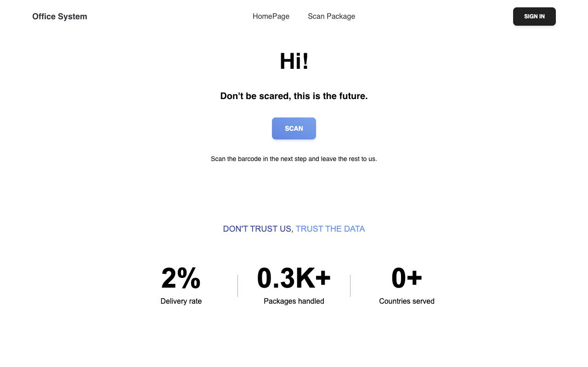
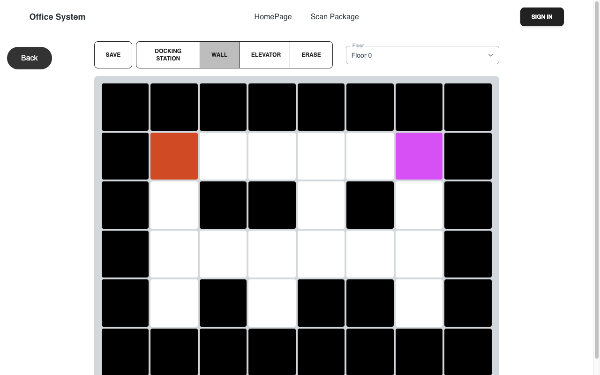
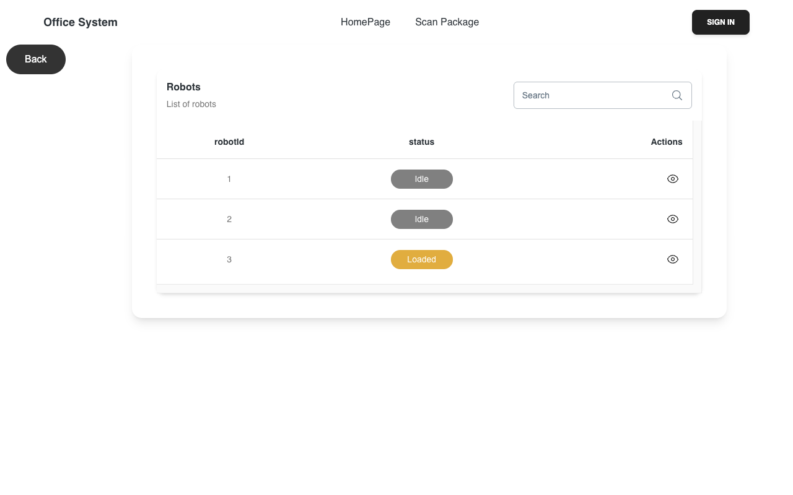
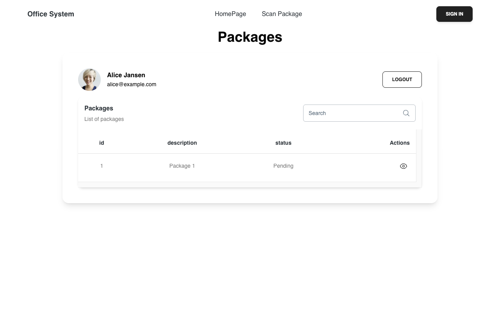

# The last 100 meters

An office delivery system: a parcel arrives at reception, its barcode is scanned, a robot is assigned and given a route to the right desk, and the employee confirms pickup by scanning their staff card. Admins draw the office floor by floor, manage employees and watch the robot fleet.

Group project for Sioux Technologies, Fontys University of Applied Sciences (ICT & Software Engineering, semester 3, September 2024 to January 2025). This repository is the archived version, cleaned up to boot with a single command and seeded demo data.

Write-up: [The last-mile problem, inside one building](https://nb.nb-limited.com/writing/the-last-100-meters), on how it was built and why it's shaped this way.

| | |
|---|---|
|  |  |
|  |  |

## Run it

You need Docker with Compose.

```bash
cp .env.example .env
# Fill in MYSQL_ROOT_PASSWORD and MYSQL_PASSWORD (openssl rand -hex 16 gives a suitable value).
docker compose up -d --build
```

| What | Where |
|---|---|
| Web app | http://localhost:5173 (or the `WEB_PORT` you set) |
| API | http://localhost:8080 |
| API docs (Swagger) | http://localhost:8080/docs/swagger |

Flyway creates the schema and loads the demo data on first boot: a two-floor office with a docking station and an elevator, five employees with desks, and three idle robots.

### Trying the flow

- **Admin.** Sign in with `admin@example.com` / `adminPassword`. This check runs in the browser only; see Known issues.
- **A parcel arrives.** The scan page reads EAN and Code 128 barcodes through the webcam. The demo parcel service knows `8710993009240` (Alice) and `8710993008700` (Bob). Without a camera, call `POST /packages/{barcode}` from Swagger instead.
- **The route.** `GET /maps/solve/1` with a body like `{"floor": 1, "row": 3, "col": 5}` returns the robot's moves: `R`, `L`, `U`, `D` within a floor and `^` or `v` for the elevator.
- **Pickup.** The employee page reads staff cards as Codabar (`A1000001A` for Alice) and marks the parcel delivered, which frees the robot.

## How it's built

```
backend/   Spring Boot 3.3, Java 17, Spring Data JPA, Flyway, MySQL 8, springdoc OpenAPI
frontend/  React 18 with Vite, Material Tailwind, Quagga for barcode scanning
docs/
  architecture/  C4 model: system context, containers and components (SVG + PlantUML)
  screenshots/
```

The backend is layered into controllers, a business layer with services and validators, and a persistence layer behind repository interfaces. The office is stored as a grid per floor; the route solver searches it depth-first, keeps the shortest path found and prunes any branch longer than that, then joins floors through the elevator.

The backend's one test starts the full application context, so it needs a database:

```bash
docker run --rm -d --name last100-test-db -p 3307:3306 \
  -e MYSQL_ROOT_PASSWORD=root -e MYSQL_DATABASE=interoff_db mysql:8.0
cd backend && SPRING_DATASOURCE_URL=jdbc:mysql://localhost:3307/interoff_db \
  SPRING_DATASOURCE_USERNAME=root SPRING_DATASOURCE_PASSWORD=root ./gradlew test
```

## Known issues

Carried over from the original project and left as they were:

- The admin sign-in is checked in the browser against fixed credentials. The API itself has no authentication.
- The parcel service is a stand-in for a real carrier API and knows five barcodes.
- Every floor of a map must have the same number of rows and columns.
- The route solver explores every path up to the best one found, so its running time grows quickly on large open floors.
- `npm run lint` reports 47 errors, mostly unused imports. The frontend builds and runs.

## Status

Archived. Spring Boot is pinned at the final 3.3 patch, which is out of upstream support. It is meant to be read and run locally, not deployed. See [SECURITY.md](SECURITY.md).

## License

Source-available under the [PolyForm Noncommercial License 1.0.0](LICENSE). You may read, run, modify and share it for any noncommercial purpose, as long as the copyright notice comes along. This repository is a showcase, so it doesn't take issues or pull requests. Forks are welcome under the license. Commercial use needs a separate paid license; contact [NB Limited](https://nb-limited.com).
